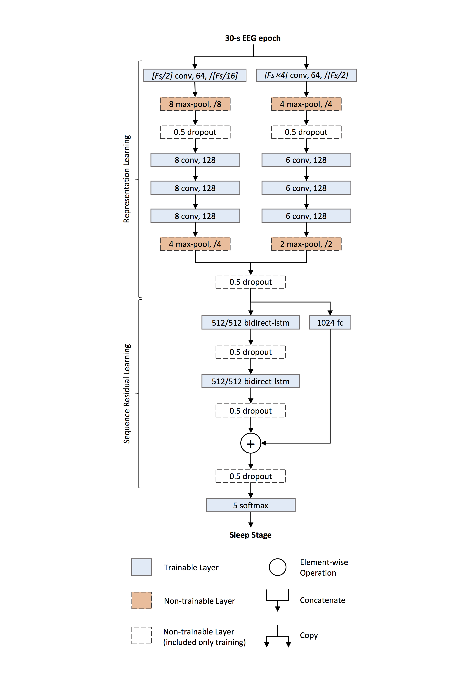
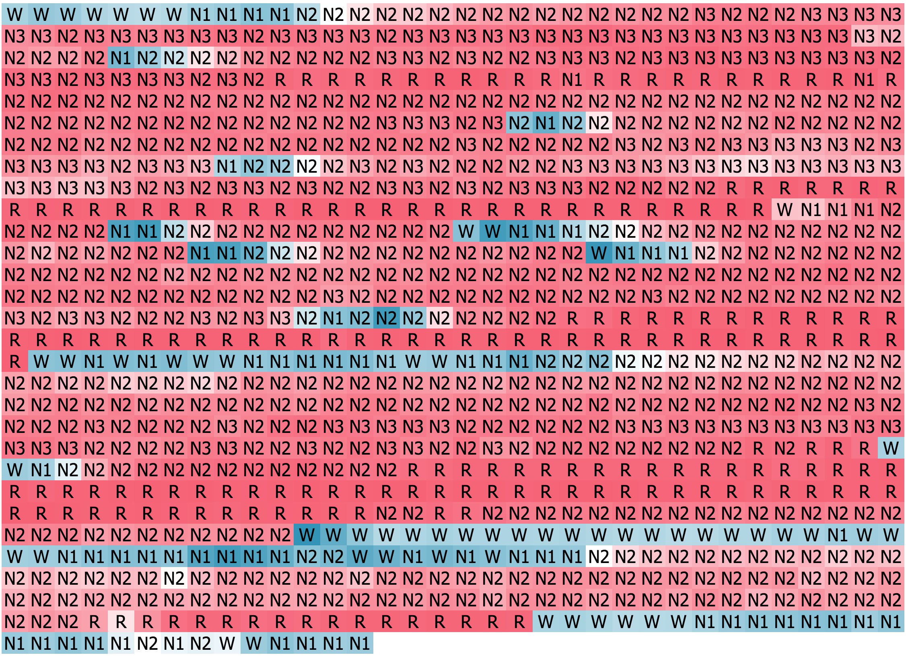

# DeepSleepNet #
A deep learning model for automatic sleep stage scoring based on raw, single-channel EEG.

**We have published a more efficient deep learning model, named TinySleepNet, which is much smaller and can achieve a better scoring performance.**

***TinySleepNet: An Efficient Deep Learning Model for Sleep Stage Scoring based on Raw Single-Channel EEG by Akara Supratak and Yike Guo from The Faculty of ICT, Mahidol University and Imperial College London respectively*. [[paper](https://ieeexplore.ieee.org/document/9176741)][[github](https://github.com/akaraspt/tinysleepnet)]**

Code for the model in the paper DeepSleepNet: a Model for Automatic Sleep Stage Scoring based on Raw Single-Channel EEG by Akara Supratak, Hao Dong, Chao Wu, Yike Guo from Data Science Institute, Imperial College London.

This work has been accepted for publication in [IEEE Transactions on Neural Systems and Rehabilitation Engineering](http://ieeexplore.ieee.org/document/7961240/).

You can also find our accepted version before the publication in [arXiv](https://arxiv.org/abs/1703.04046).

The architecture of DeepSleepNet:

Note: Fs is the sampling rate of the input EEG signals

This figure illustrates one interpretable LSTM cell from the model, which learn to keep track when each subject is awake (i.e., in W stage):

## Environment ##

The following setup has been used to reproduce this work:

- Ubuntu 18.04 / Windows 10 1903 x64
- CUDA toolkit 10.0 and CuDNN v7.6.4
- Python 3.5.4 x64
- tensorflow-gpu (1.15.2)
- matplotlib (1.5.3)
- scikit-learn (0.19.1)
- scipy (1.4.1)
- numpy (1.18.2)
- pandas (0.25.3)
- mne (0.20.0)
- [tensorlayer](https://github.com/zsdonghao/tensorlayer) (optional)
- MongoDB (optional)
- [eAE](https://github.com/aoehmichen/eae-docker) (optional)

## Prepare dataset ##
We evaluated our DeepSleepNet with MASS and [Sleep-EDF](https://physionet.org/pn4/sleep-edfx/) dataset.

For the MASS dataset, you have to request for a permission to access their dataset. 
For the [Sleep-EDF](https://physionet.org/pn4/sleep-edfx/) dataset, you can run the following scripts to download SC subjects.

    cd data
    chmod +x download_physionet.sh
    ./download_physionet.sh

Then run the following script to extract specified EEG channels and their corresponding sleep stages.

    python prepare_physionet.py --data_dir data --output_dir data/eeg_fpz_cz --select_ch 'EEG Fpz-Cz'
    python prepare_physionet.py --data_dir data --output_dir data/eeg_pz_oz --select_ch 'EEG Pz-Oz'

## Training a model ##
Run this script to train a DeepSleepNet model for the first fold of the 20-fold cross-validation.

    python train.py --data_dir data/eeg_fpz_cz --output_dir output --n_folds 20 --fold_idx 0 --pretrain_epochs 100 --finetune_epochs 200 --resume False

You need to train a DeepSleep model for every fold (i.e., `fold_idx=0...19`) before you can evaluate the performance. You can use the following script to run batch training

    chmod +x batch_train.sh
    ./batch_train.sh data/eeg_fpz_cz/ output 20 0 19 0

## Scoring sleep stages ##
Run this script to determine the sleep stages for the withheld subject for each cross-validation fold.

    python predict.py --data_dir data/eeg_fpz_cz --model_dir output --output_dir output

The output will be stored in numpy files.

## Get a summary ##
Run this script to show a summary of the performance of our DeepSleepNet compared with the state-of-the-art hand-engineering approaches. The performance metrics are overall accuracy, per-class F1-score, and macro F1-score.

    python summary.py --data_dir output

## Submit the job to the eAE cluster equipped with TensorLayer ##

1. Setup an eAE cluster (follows the instruction in this [link](https://github.com/aoehmichen/eae-docker))
2. Setup a MongoDB
3. Change location of MongoDB in `deepsleep/trainer.py`
4. Modify `submit_eAE.py`
5. Run `python submit_eAE.py`

## ToDo ##
- Release a version that does not depend on MongoDB and Tensorlayer (easier to install, but could take longer time for training).

## Citation ##
If you find this useful, please cite our work as follows:

    @article{Supratak2017,
        title = {DeepSleepNet: a Model for Automatic Sleep Stage Scoring based on Raw Single-Channel EEG},
        author = {Supratak, Akara and Dong, Hao and Wu, Chao and Guo, Yike},
        journal = {IEEE Transactions on Neural Systems and Rehabilitation Engineering},
        year = {2017},
        month = {Nov},
        volume = {25}, 
        number = {11}, 
        pages = {1998-2008}, 
        doi = {10.1109/TNSRE.2017.2721116}, 
        ISSN = {1534-4320}, 
    }

## Licence ##
- For academic and non-commercial use only
- Apache License 2.0
